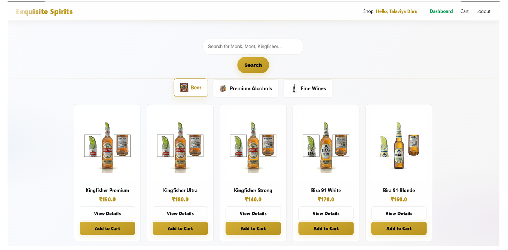
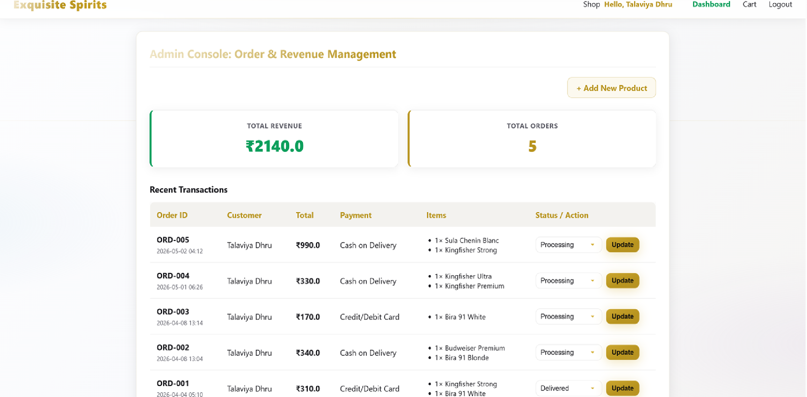
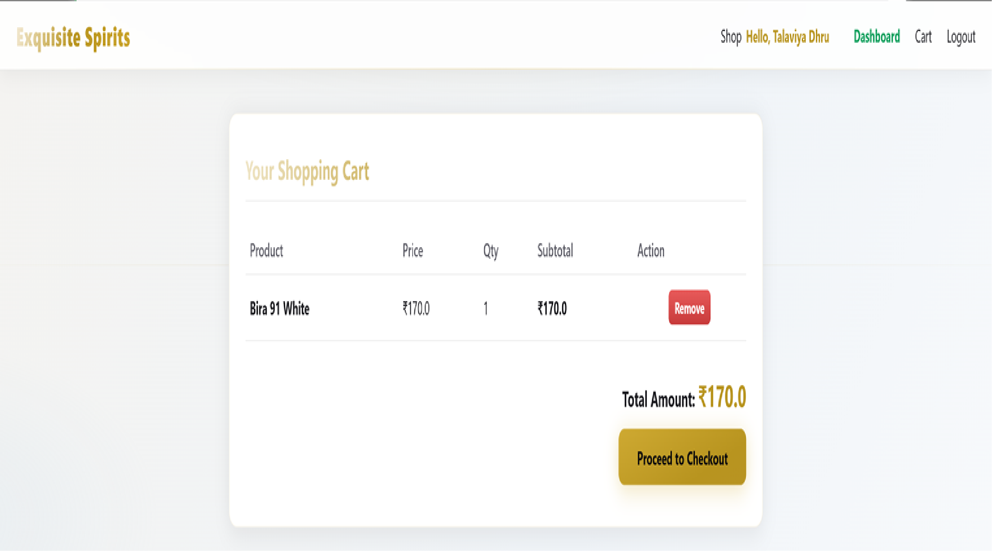
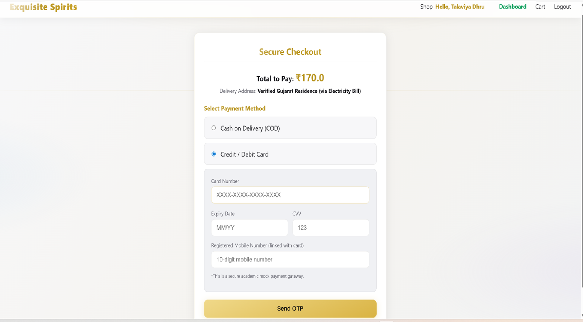

# 🥃 Premium Liquor E-Commerce & AI Compliance System






## 📌 Project Overview

The **Premium Liquor Store System** is a specialized, legally-compliant e-commerce platform built as a final-year Master of Computer Applications (MCA) project. 

Unlike standard e-commerce applications, this system integrates an automated **Computer Vision (CV)** layer to handle mandatory document verification. Designed with the strict regulatory frameworks of the Gujarat IT sector in mind, the platform ensures that users meet age and permit restrictions using AI, completely eliminating the need for manual KYC verification.

## ✨ Key Features

### 🔐 1. AI-Powered Legal Compliance (OCR)

- **Document Extraction:** Utilizes `PyTesseract` and `OpenCV` to scan uploaded ID documents (like an Aadhaar Card).
- **Automated Age Gating:** Extracts the "Date of Birth," mathematically verifies that the user is strictly 21+, and validates their state liquor permit before granting access to the storefront.

### 💳 2. Advanced Secure Checkout & 2FA

- **Input Masking & Validation:** Implements custom client-side JavaScript to auto-format credit cards and uses the Luhn algorithm logic to strictly validate Visa (4) and Mastercard (5) prefixes.
- **Simulated Two-Factor Authentication:** Features a secure, Glassmorphism-styled OTP (One Time Password) overlay that simulates a real-world bank authorization gateway.

### 👥 3. Role-Based Access Control (RBAC)

- **Customer Portal:** Browse inventory, manage cart, and download auto-generated HTML/TXT transaction invoices.
- **Admin Dashboard:** Protected by custom Python `@login_required` and `@admin_required` decorators. Allows full CRUD (Create, Read, Update, Delete) operations for inventory management.

### 🎨 4. "Midnight Amber" Dynamic UI

- Custom-built internal CSS architecture utilizing **Glassmorphism** (frosted glass effects) and dynamic hover animations.
- Responsive dark mode interface accented with premium metallic gold elements to reflect high-end branding.

---

## 🛠️ Technology Stack

- **Backend:** Python 3.x, Flask
- **Database:** SQLite / MySQL
- **AI / Machine Learning:** PyTesseract (Optical Character Recognition), OpenCV (Image Preprocessing)
- **Frontend:** HTML5, CSS3 (CSS Variables, Backdrop Filters), Vanilla JavaScript
- **Architecture:** Monolithic MVC (Model-View-Controller) structure using Jinja2 Templating

---

## 🚀 Installation & Setup

Follow these steps to run the project locally on your machine.

### Prerequisites

- Python 3.8 or higher installed on your system.
- Tesseract-OCR installed on your machine (Requires adding to system PATH).

### Step-by-Step Guide

1. **Clone the repository:**
  ```bash
   git clone [https://github.com/YourUsername/Premium-Liquor-Store.git](https://github.com/YourUsername/Premium-Liquor-Store.git)
   cd Premium-Liquor-Store

  # Create a Virtual Environment:
   python -m venv venv

  # Activate the Virtual Environment:
   Windows: venv\Scripts\activate
   Mac/Linux: source venv/bin/activate

  # Install Dependencies:
    pip install -r requirements.txt
   (Ensure flask, pytesseract, opencv-python, and Pillow are in your requirements list).

  # Run the Application:
    python app.py 

  # Access the Web App: Open your browser and navigate to http://127.0.0.1:5000  

  � Testing & Quality Assurance:
  ```

The system has undergone rigorous V-Model testing, including:

Negative Testing: Minor (under 21) Aadhaar cards are successfully blocked.

Security Testing: Direct URL manipulation to access the /admin panel by a standard user is intercepted and redirected.

Component Testing: Cart persistence logic updated to prevent duplicate item rows in the database.

🔮 Future Scope:
As an enterprise-level proof of concept, future enhancements could include:

Biometric Authentication (WebAuthn): For passwordless, Zero-Trust login.

Blockchain Ledger: Transitioning invoices to a private Hyperledger to ensure tax and legal audit immutability.

Liveness Detection: Enhancing the OCR with webcam facial matching to prevent stolen ID usage.

⚠️ Disclaimer
This project was developed strictly for academic purposes as part of a Master of Computer Applications (MCA) curriculum. It is a simulation of a regulated e-commerce environment and does not process real financial transactions or facilitate the actual sale of restricted goods.

Developed by Dhru Talaviya]  Final Year MCA Project